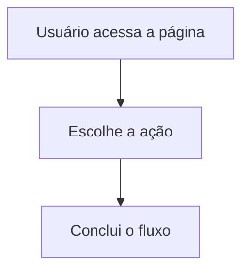

# Componentes e padrões para docs MDX

Esta referência apoia a skill `docs-mdx-authoring`. Use-a quando precisar decidir entre texto puro e componentes MDX da central de documentação.

## Estrutura base de um documento

Todo documento da central deve ficar em `src/@content/docs/**/*.mdx`. O caminho do arquivo define a URL pública, então a escolha da pasta também comunica a organização da navegação. No topo do arquivo, use o frontmatter com `title`, `description`, `category`, `order`, `author` e `updatedAt`.

Quando a página for nova, comece com uma abertura curta em parágrafo explicando o que o leitor vai resolver ali. Depois distribua o conteúdo em seções `h2` e, se necessário, `h3`, porque esse contorno alimenta automaticamente o índice lateral.

```mdx
---
title: Acesso inicial
description: Como acessar o sistema pela primeira vez.
category: Primeiros passos
order: 1
author: Equipe do Produto
updatedAt: 2026-04-28
---

## Quando usar

Explique em um ou dois parágrafos o contexto da rotina, para quem ela serve e o que muda ao final da leitura.
```

## Regra editorial principal

Prefira parágrafos quando a informação puder ser explicada em fluxo contínuo. Isso costuma funcionar melhor para contexto, orientações, observações e explicações de regra. Use listas quando houver sequência real, itens independentes que precisem ser escaneados rapidamente ou comparações explícitas. Use componentes quando eles organizarem melhor o conteúdo do que texto puro.

## Callout

Use `Callout` para destacar uma observação importante, um cuidado operacional ou uma dica útil que mereça sair do fluxo principal sem virar um subtítulo próprio. Se a informação puder viver naturalmente em um parágrafo curto, mantenha em texto simples.

```mdx
import { Callout } from "@presentation/components/docs/Callout.tsx";

<Callout title="Antes de começar" type="hint">
  Separe as informações necessárias antes de iniciar o preenchimento.
</Callout>
```

Prefira `type="info"` para notas neutras, `type="hint"` para orientação prática e `type="warning"` para riscos, bloqueios ou consequências importantes.

## Steps

Use `Steps` quando existir uma sequência operacional clara em que a ordem altera a execução. Evite usar esse componente para checklists soltos, conceitos ou listas de benefícios.

```mdx
import { Steps } from "@presentation/components/docs/Step.tsx";

export const passosCadastro = [
  {
    title: "Abra a tela",
    children: "Acesse o menu principal e entre na rotina desejada."
  },
  {
    title: "Preencha os dados",
    children: "Revise os campos obrigatórios e confirme as informações antes de avançar."
  }
];

<Steps steps={passosCadastro} />
```

Quando o conteúdo de cada passo for curto e explicável em uma frase, uma lista numerada tradicional também pode ser suficiente.

## Cards

Use `Cards` para apontar páginas relacionadas, próximos passos ou áreas irmãs da documentação. Não use `Cards` para substituir parágrafos explicativos nem para listar conteúdo que ainda precisa ser lido em ordem.

```mdx
import { Cards } from "@presentation/components/docs/Cards.tsx";
import { Info } from "lucide-react";

<Cards num={2}>
  <Cards.Card
    icon={<Info />}
    title="Configuração inicial"
    description="Veja como preparar o ambiente antes do primeiro uso."
    href="/docs/primeiros-passos/configuracao-inicial"
    arrow
  />
</Cards>
```

Se o objetivo for apenas mencionar um próximo documento em uma frase, prefira um link comum dentro do parágrafo.

## FileTree

Use `FileTree` quando a explicação depender da visualização de hierarquia de pastas e arquivos. Para citar apenas um ou dois caminhos, um parágrafo com código inline costuma ser mais direto.

```mdx
import { FileTree } from "@presentation/components/docs/FileTree.tsx";

<FileTree>
  <FileTree.Folder name="src">
    <FileTree.Folder name="@content">
      <FileTree.Folder name="docs">
        <FileTree.File
          name="introducao.mdx"
          description="Página inicial da documentação"
        />
      </FileTree.Folder>
    </FileTree.Folder>
  </FileTree.Folder>
</FileTree>
```

## Tabs

Use `Tabs` quando houver duas ou mais variações equivalentes do mesmo conteúdo, como ambientes, perfis, plataformas ou formas alternativas de executar a mesma tarefa. Não use para esconder conteúdo essencial que deveria aparecer linearmente.

```mdx
import { TabItem, Tabs } from "@presentation/components/docs/Tabs.tsx";

<Tabs defaultValue="web">
  <TabItem value="web" label="Web">
    Oriente o fluxo para quem acessa pelo navegador.
  </TabItem>
  <TabItem value="mobile" label="Mobile">
    Explique a variação do processo no aplicativo.
  </TabItem>
</Tabs>
```

Se a diferença entre as variações for pequena, prefira explicar isso em um ou dois parágrafos corridos.

## DataTable

Use `DataTable` quando o documento precisar comparar registros, resumir propriedades ou apresentar uma matriz pequena de informações que dependa de leitura por coluna. Para texto corrido, checklists simples ou conteúdo sem relação tabular clara, prefira parágrafos ou listas comuns.

```mdx
import { DataTable } from "@presentation/components/docs/DataTable.tsx";

export const colunas = [
  { key: "campo", header: "Campo" },
  { key: "descricao", header: "Descrição" },
  { key: "obrigatorio", header: "Obrigatório", align: "center" }
];

export const linhas = [
  {
    campo: "nome",
    descricao: "Nome público exibido na documentação.",
    obrigatorio: "Sim"
  }
];

<DataTable columns={colunas} rows={linhas} />
```

Use `caption` quando a tabela precisar de contexto adicional e `render` apenas para pequenas transformações visuais. Se a tabela precisar de filtro, ordenação ou paginação, trate como uma interface específica em vez de forçar tudo dentro do MDX.

## Mermaid

Use Mermaid quando um fluxo, relação ou arquitetura ficar mais claro como diagrama. Como a renderização já é tratada globalmente pelo projeto, basta usar um bloco de código com linguagem `mermaid`.

````mdx

````

Se o diagrama for pequeno demais para justificar o bloco visual, descreva a sequência em texto.

## Atualização de documentos existentes

Ao revisar um `.mdx` já existente, preserve a intenção da página, a rota implícita pelo caminho do arquivo e os metadados que continuam corretos. Ajuste `updatedAt` quando houver revisão relevante. Se encontrar listas extensas que estejam funcionando apenas como texto quebrado em linhas, reescreva o trecho em parágrafos antes de pensar em adicionar componentes.

Também vale revisar se algum componente antigo ainda está ajudando a leitura. Quando não estiver, simplifique. O objetivo da central é clareza e ritmo de leitura, não densidade de blocos visuais.
