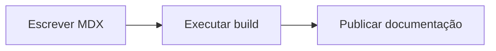

## Quando usar

Use Mermaid para fluxos, relações entre módulos, timelines curtas e diagramas que mudam com frequência. Como o diagrama é escrito em texto, ele costuma ser mais fácil de revisar junto com o documento do que uma imagem estática.

## Como funciona neste template

Não é preciso importar componente no topo do `.mdx`. O projeto intercepta blocos `pre` e `figure` marcados com linguagem `mermaid` por meio de `src/@presentation/components/docs/mdx-components.tsx`, e então renderiza o gráfico com `MermaidDiagram`.

## Exemplo

````mdx

````

## Resultado


## Boa prática

Prefira diagramas curtos, com uma ideia principal por bloco. Quando o fluxo cresce demais, costuma ser melhor dividir a explicação em dois diagramas menores e acompanhá-los com texto.
