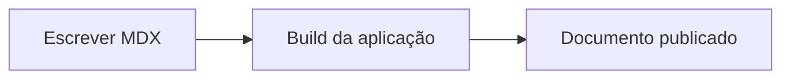

## Quando usar

Use blocos `mermaid` para criar diagramas diretamente no MDX. Eles são renderizados automaticamente e acompanham o tema claro/escuro da aplicação.

## Uso

````mdx

````

## Exemplo renderizado


## Boa prática

Prefira diagramas curtos e focados. Para fluxos grandes, divida a explicação em seções menores ou use mais de um diagrama.
