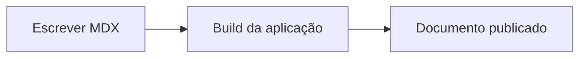

import { Callout } from "@/components/docs/Callout.tsx";
import { Cards } from "@/components/docs/Cards.tsx";
import { FileTree } from "@/components/docs/FileTree.tsx";
import { Steps } from "@/components/docs/Step.tsx";
import { Tabs, TabItem } from "@/components/docs/Tabs.tsx";
import { Blocks, GitBranch, Network } from "lucide-react";

export const exemploSteps = [
  {
    title: "Descreva a ação",
    children: "Use um verbo direto para indicar o que o leitor precisa fazer."
  },
  {
    title: "Explique o resultado",
    children: "Informe o que muda depois da ação para reduzir dúvidas durante a execução."
  },
  {
    title: "Finalize com conferência",
    children: "Mostre como o usuário pode validar se concluiu o processo corretamente."
  }
]

## Componentes disponíveis

Os arquivos MDX podem usar componentes React importados de `src/components/docs`. Eles ajudam a padronizar alertas, dicas e sequências de passos.

## Callout

Use `Callout` para destacar informações importantes sem interromper o fluxo do documento.

```mdx
import { Callout } from "@/components/docs/Callout.tsx";

<Callout title="Antes de começar" type="hint">
  Confirme se o usuário tem permissão para acessar esta rotina.
</Callout>
```

### Tipos de callout

- `info`: nota informativa.
- `hint`: dica ou recomendação.
- `warning`: aviso de atenção.

<Callout title="Exemplo informativo" type="info">
  Use notas para explicar contexto, dependências ou comportamento esperado.
</Callout>

<Callout title="Exemplo de dica" type="hint">
  Use dicas para orientar uma forma mais eficiente de executar a tarefa.
</Callout>

<Callout title="Exemplo de atenção" type="warning">
  Use avisos quando uma ação puder afetar dados, permissões ou disponibilidade.
</Callout>

## Steps

Use `Steps` para representar um procedimento sequencial.

```mdx
import { Steps } from "@/components/docs/Step.tsx";

export const passos = [
  {
    title: "Abra a tela",
    children: "Acesse o menu principal e selecione a rotina desejada."
  },
  {
    title: "Preencha os dados",
    children: "Informe os campos obrigatórios antes de salvar."
  }
]

<Steps steps={passos} />
```

### Exemplo renderizado

<Steps steps={exemploSteps} />

## Cards

Use `Cards` para destacar links importantes, áreas de documentação ou pontos de entrada para guias relacionados. Cada card aceita ícone, título, descrição opcional, link e seta visual.

```mdx
import { Cards } from "@/components/docs/Cards.tsx";
import { Blocks, GitBranch, Network } from "lucide-react";

<Cards num={3}>
  <Cards.Card
    icon={<Blocks />}
    title="Módulos"
    description="Conheça os domínios e limites de responsabilidade do sistema."
    href="/docs/arquitetura/modulos"
    arrow
  />
  <Cards.Card
    icon={<Network />}
    title="Integrações"
    description="Veja contratos, eventos e dependências externas."
    href="/docs/arquitetura/integracoes"
    arrow
  />
  <Cards.Card
    icon={<GitBranch />}
    title="Fluxos críticos"
    description="Entenda os caminhos principais entre interface, API e persistência."
    href="/docs/arquitetura/fluxos"
    arrow
  />
</Cards>
```

### Exemplo renderizado

<Cards num={3}>
  <Cards.Card
    icon={<Blocks />}
    title="Módulos"
    description="Conheça os domínios e limites de responsabilidade do sistema."
    href="/docs/arquitetura/modulos"
    arrow
  />
  <Cards.Card
    icon={<Network />}
    title="Integrações"
    description="Veja contratos, eventos e dependências externas."
    href="/docs/arquitetura/integracoes"
    arrow
  />
  <Cards.Card
    icon={<GitBranch />}
    title="Fluxos críticos"
    description="Entenda os caminhos principais entre interface, API e persistência."
    href="/docs/arquitetura/fluxos"
    arrow
  />
</Cards>

### Card isolado

<Cards.Card
  title="Checklist de arquitetura"
  description="Use este card fora do grid quando houver apenas um próximo passo recomendado."
  href="/docs/arquitetura/checklist"
  arrow
/>

## FileTree

Use `FileTree` para representar estruturas de pastas e arquivos em documentos de arquitetura, organização de módulos ou convenções do projeto. O componente é apenas visual e não possui interação.

```mdx
import { FileTree } from "@/components/docs/FileTree.tsx";

<FileTree>
  <FileTree.Folder name="src" defaultOpen>
    <FileTree.Folder name="modules">
      <FileTree.Folder name="billing" description="Contexto de cobrança">
        <FileTree.File name="billing.controller.ts" />
        <FileTree.File name="billing.service.ts" active />
        <FileTree.File name="billing.repository.ts" />
      </FileTree.Folder>
    </FileTree.Folder>
    <FileTree.File name="main.tsx" />
  </FileTree.Folder>
</FileTree>
```

### Exemplo renderizado

<FileTree>
  <FileTree.Folder name="src" defaultOpen>
    <FileTree.Folder name="modules">
      <FileTree.Folder name="billing" description="Contexto de cobrança">
        <FileTree.File name="billing.controller.ts" />
        <FileTree.File name="billing.service.ts" active />
        <FileTree.File name="billing.repository.ts" />
      </FileTree.Folder>
    </FileTree.Folder>
    <FileTree.File name="main.tsx" />
  </FileTree.Folder>
</FileTree>

## Tabs

Use `Tabs` e `TabItem` para alternar entre variações de um mesmo procedimento, como comandos por ambiente, exemplos por framework ou visões por perfil de usuário.

```mdx
import { Tabs, TabItem } from "@/components/docs/Tabs.tsx";

<Tabs defaultValue="api">
  <TabItem value="api" label="API">
    Use esta aba para documentar contratos, endpoints e integrações.
  </TabItem>
  <TabItem value="web" label="Web">
    Use esta aba para documentar telas, componentes e fluxos do frontend.
  </TabItem>
  <TabItem value="mobile" label="Mobile">
    Use esta aba para documentar comportamentos específicos do app.
  </TabItem>
</Tabs>
```

### Exemplo renderizado

<Tabs defaultValue="api">
  <TabItem value="api" label="API">
    Use esta aba para documentar contratos, endpoints e integrações.
  </TabItem>
  <TabItem value="web" label="Web">
    Use esta aba para documentar telas, componentes e fluxos do frontend.
  </TabItem>
  <TabItem value="mobile" label="Mobile">
    Use esta aba para documentar comportamentos específicos do app.
  </TabItem>
</Tabs>

### Abas sincronizadas

Use `groupId` para sincronizar escolhas entre grupos de abas relacionados. O valor escolhido é salvo no navegador.

<Tabs groupId="ambiente" defaultValue="dev">
  <TabItem value="dev" label="Desenvolvimento">
    Execute `bun run dev` para iniciar o ambiente local.
  </TabItem>
  <TabItem value="prod" label="Produção">
    Execute `bun run build` antes de publicar a aplicação.
  </TabItem>
</Tabs>

<Tabs groupId="ambiente" defaultValue="dev">
  <TabItem value="dev" label="Desenvolvimento">
    Use variáveis locais e serviços de homologação.
  </TabItem>
  <TabItem value="prod" label="Produção">
    Use variáveis protegidas e serviços produtivos.
  </TabItem>
</Tabs>

## Mermaid

Use blocos `mermaid` para criar diagramas diretamente no MDX. Eles são renderizados automaticamente e acompanham o tema claro/escuro da aplicação.

````mdx

````

### Exemplo renderizado


## LaTeX/KaTeX

Use LaTeX para escrever fórmulas inline, como $E = mc^2$, ou blocos matemáticos maiores com `$$`.

```mdx
O custo médio é $C_m = \frac{C_t}{Q}$.

$$
\int_0^1 x^2 \, dx = \frac{1}{3}
$$
```

### Exemplo renderizado

O custo médio é $C_m = \frac{C_t}{Q}$.

$$
\int_0^1 x^2 \, dx = \frac{1}{3}
$$

## Índice lateral

O índice lateral é gerado automaticamente com os títulos `h2` e `h3` do documento. Não é necessário declarar uma lista manual de seções.

### Como criar uma seção

Use `##` para criar uma seção principal:

```mdx
## Configuração inicial
```

### Como criar uma subseção

Use `###` para criar uma subseção:

```mdx
### Permissões necessárias
```

## Recomendações de escrita

- Comece cada página explicando quando ela deve ser usada.
- Prefira frases curtas e exemplos concretos.
- Use componentes apenas quando eles ajudarem a leitura.
- Evite transformar todo parágrafo em alerta.
- Revise títulos, descrições e datas antes de publicar.

## Verificação final

Depois de escrever ou alterar documentos, execute `bun run build`. Esse comando valida TypeScript, gera a aplicação e cria o índice de busca usado em produção.
